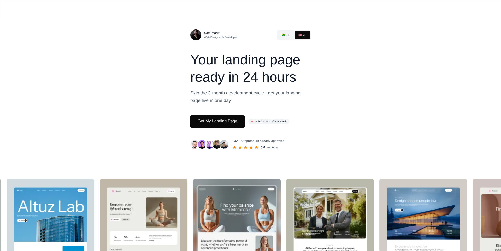

# Landing 24h



This is a conversion-focused landing page for my freelance service where I create custom landing pages for entrepreneurs and small businesses in just 24 hours. The project demonstrates advanced web development techniques while serving as a real business tool to attract clients and generate additional revenue.

**The Business Model:**
- Offer rapid landing page development (24h delivery)
- Target entrepreneurs who need quick, professional web presence
- Provide an alternative income stream through freelance work
- Showcase technical expertise to attract higher-value clients

Built with Next.js 15 and modern web technologies, automatically detecting user location to serve content in Portuguese or English.

## ✨ Features

- **Automatic geo-detection** - Routes users to appropriate language based on location
- **Interactive chat flow** - Guided conversation to convert visitors
- **Optimized performance** - Fast loading with image optimization and lazy loading
- **Facebook Pixel integration** - Built-in conversion tracking
- **Responsive design** - Works seamlessly on all devices
- **SEO optimized** - International SEO with hreflang and structured data

## 🚀 Quick Start

```bash
# Install dependencies
npm install

# Start development server
npm run dev

# Build for production
npm run build

# Start production server
npm start
```

Open [http://localhost:3000](http://localhost:3000) to view the project.

## 🌍 Internationalization

The app automatically redirects users based on their location:
- **Portuguese countries** (BR, PT, AO, etc.) → `/` (Portuguese)
- **Other countries** → `/en` (English)

Manual language switching is available via the language toggle in the header.

## 📁 Key Structure

```
├── app/[locale]/          # Internationalized pages
├── components/            # React components
│   ├── sections/         # Page sections (hero, chat, projects)
│   └── ui/               # Reusable UI components
├── hooks/                # Custom React hooks
├── lib/                  # Utilities and configurations
├── messages/             # i18n translation files
└── middleware.ts         # Geo-detection and routing
```

## 🛠 Tech Stack

- **Next.js 15** - React framework with App Router
- **TypeScript** - Type safety
- **Tailwind CSS 4** - Styling
- **next-intl** - Internationalization
- **React Intersection Observer** - Scroll animations
- **Facebook Pixel** - Analytics and conversion tracking

## 📱 Contact Integration

The chat flow integrates with WhatsApp for lead conversion, with messages automatically translated based on the user's language preference.
